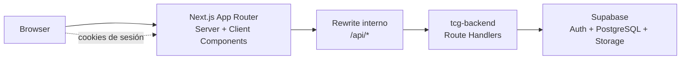
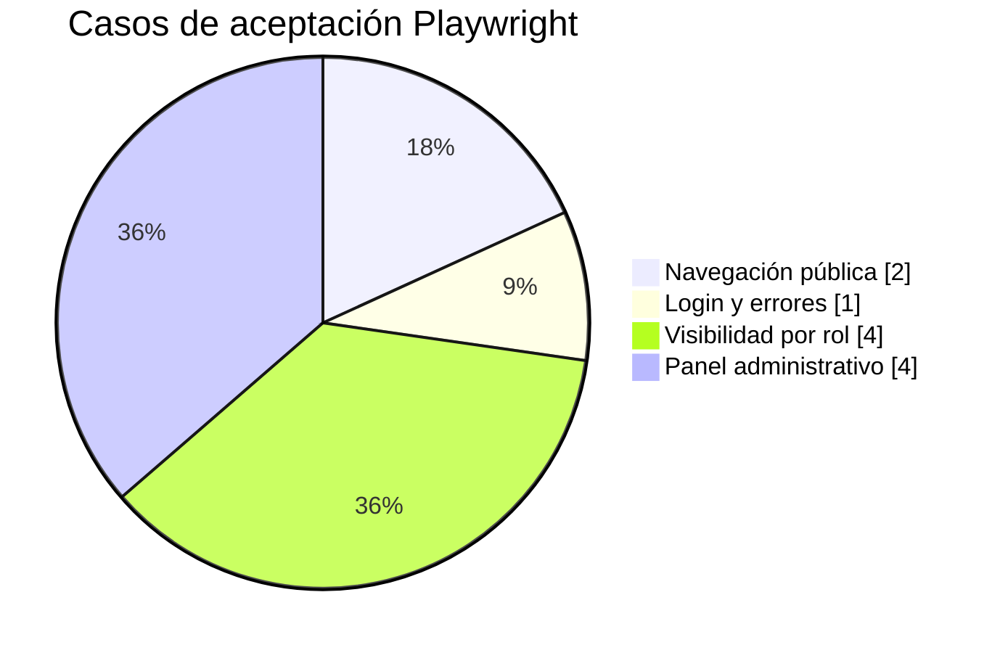

# TCG Hub — Frontend


Interfaz web de **TCG Hub / TCG Tournaments**, una plataforma para descubrir, publicar e inscribirse en torneos de Trading Card Games en Chile.

Este repositorio contiene la experiencia de usuario: portada pública, listado de torneos, autenticación, panel de jugador, panel de tienda y centro de operaciones administrativo. La API vive separada en el repositorio `tcg-backend`.

## Qué resuelve

TCG Hub centraliza la difusión de torneos TCG que normalmente queda repartida entre redes sociales, chats y publicaciones informales.

- Jugadores pueden descubrir torneos publicados, filtrar por ciudad/juego y gestionar sus inscripciones.
- Tiendas pueden crear, editar y publicar torneos desde su panel privado.
- Administradores pueden revisar actividad, publicar borradores, asignar roles y mantener catálogos base.

## Arquitectura del frontend



El frontend consume `/api/*` como si fuera mismo origen. `next.config.ts` reescribe esas llamadas hacia `BACKEND_URL`, lo que mantiene la experiencia simple para el navegador y evita exponer detalles internos de la API.

## Stack

| Área | Tecnología |
| --- | --- |
| Framework | Next.js 16, App Router |
| UI | React 19, Tailwind CSS 4, Lucide Icons |
| Lenguaje | TypeScript |
| Auth cliente | Supabase SSR / Supabase JS |
| Validación | Zod |
| Pruebas E2E/aceptación | Playwright + Chromium |

## Requisitos

- Node.js 20+
- npm
- Backend `tcg-backend` corriendo localmente o desplegado
- Proyecto Supabase configurado para autenticación

## Instalación

```bash
npm install
```

Copia `.env.example` a `.env.local` y completa las variables:

```bash
NEXT_PUBLIC_SUPABASE_URL=https://<project-ref>.supabase.co
NEXT_PUBLIC_SUPABASE_PUBLISHABLE_KEY=<anon-key>
NEXT_PUBLIC_APP_URL=http://localhost:3000
BACKEND_URL=http://localhost:3001

# Opcional: autocomplete de direcciones
NEXT_PUBLIC_GOOGLE_MAPS_API_KEY=
```

Luego inicia el frontend:

```bash
npm run dev
```

Por defecto queda disponible en [http://localhost:3000](http://localhost:3000).

## Variables de entorno

| Variable | Requerida | Descripción |
| --- | --- | --- |
| `NEXT_PUBLIC_SUPABASE_URL` | Sí | URL del proyecto Supabase. |
| `NEXT_PUBLIC_SUPABASE_PUBLISHABLE_KEY` | Sí | Publishable/anon key usada por el cliente. |
| `NEXT_PUBLIC_APP_URL` | Sí | URL base pública del frontend. En local: `http://localhost:3000`. |
| `BACKEND_URL` | Sí | URL del backend usado por los rewrites de `/api/*`. En local: `http://localhost:3001`. |
| `NEXT_PUBLIC_GOOGLE_MAPS_API_KEY` | No | Habilita autocomplete de direcciones si existe una API key con Maps/Places. |

## Comandos

| Comando | Uso |
| --- | --- |
| `npm run dev` | Levanta Next.js en desarrollo. |
| `npm run build` | Compila la aplicación para producción. |
| `npm run start` | Sirve la build de producción. |
| `npm run lint` | Ejecuta ESLint. |
| `npm run typecheck` | Valida TypeScript sin emitir archivos. |
| `npm run test:acceptance` | Ejecuta pruebas Playwright headless. |
| `npm run test:acceptance:ui` | Abre el modo interactivo de Playwright. |

## Pruebas del frontend

Las pruebas de aceptación levantan un backend local simulado, por lo que no crean datos reales ni requieren conexión a Supabase.

```bash
npx playwright install chromium
npm run test:acceptance
```

Cobertura automatizada actual:



| Suite | Casos | Qué valida |
| --- | ---: | --- |
| Navegación pública | 2 | Portada, búsqueda y filtros reproducibles por URL. |
| Login | 1 | Manejo accesible de errores de autenticación. |
| Roles | 4 | Visitante/jugador no ven “Publicar evento”; tienda/admin sí. |
| Admin | 4 | Mesa de trabajo, publicación de borradores, asignación de roles y responsive móvil. |

Los specs viven en `tests/acceptance/` y el stack de pruebas en `tests/fixtures/`.

## Rutas principales

| Ruta | Propósito |
| --- | --- |
| `/` | Portada pública con torneos destacados y acceso a búsqueda. |
| `/torneos` | Listado público con filtros. |
| `/login`, `/signup` | Autenticación y registro. |
| `/jugador/inscripciones` | Inscripciones del jugador. |
| `/jugador/perfil` | Perfil del jugador. |
| `/tienda/crear` | Alta de tienda para usuarios autorizados. |
| `/tienda/dashboard` | Panel privado de tienda. |
| `/tienda/nuevo-torneo` | Creación de torneos. |
| `/tienda/torneos/[id]/editar` | Edición de torneos existentes. |
| `/admin` | Centro de operaciones administrativo. |

## Roles en la interfaz

| Rol | Experiencia esperada |
| --- | --- |
| Visitante | Explora torneos, inicia sesión o crea cuenta. No ve acciones privadas. |
| `jugador` | Consulta torneos e inscripciones. No puede publicar eventos. |
| `tienda` | Puede crear y publicar torneos. |
| `admin` | Accede al centro de operaciones y acciones de administración. |

## Estructura del proyecto

```text
src/
  app/                # Rutas App Router, layouts y páginas
  components/         # UI, formularios, cards y componentes de dominio
  lib/                # Auth, Supabase, constantes y helpers
tests/
  acceptance/         # Specs Playwright
  fixtures/           # Backend simulado y setup de pruebas
```

## Despliegue

El despliegue recomendado es Vercel.

Checklist mínimo:

1. Configurar variables de entorno en Preview y Production.
2. Apuntar `BACKEND_URL` al backend correspondiente.
3. Verificar que la URL pública coincida con `NEXT_PUBLIC_APP_URL`.
4. Ejecutar `npm run build`, `npm run lint`, `npm run typecheck` y `npm run test:acceptance` antes de publicar.

## Equipo

Proyecto académico DUOC UC — Ingeniería en Informática.

- Álvaro Cabezas P. — Líder / Analista Funcional
- Diego Peña S. — DBA / Frontend
- Federico Pereira — Backend / Otros

## Licencia

Uso académico.
